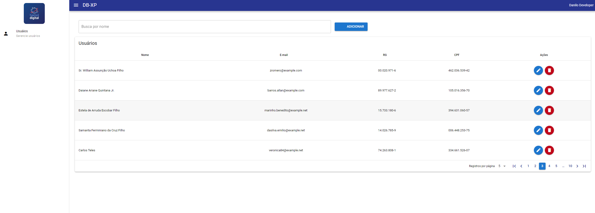

# Desafio Software Engineer

<p>Desafio Técnico Bemol Digital - XP</p>
<p>Desenvolvidodo um CRUD de usuários, cujo o nome do projeto chamei de BD-XP</p>

## Tecnologias utilizadas

<p>
Foi desenvolvido dois projetos distintos (back e front).
</p>

<ul>
<li>
No backend utilizei <a href="https://laravel.com/docs/10.x">Laravel</a>
</li>
<li>
Para o frontend, utilizei <a href="https://quasar.dev/">Quasar v2 (vue3)</a>
</li>
</ul>

<p>
</p>

## Setup para execução do projeto

<ul>
<li>
Requer node 19.5.0 e npm 9.8.1 ou superior
</li>
<li>
Requer composer 2.5.1 ou superior
</li>
<li>
Requer PHP 8.1 ou superior
</li>
<li>
Requer Banco de dados postgres
</li>
</ul>

<ol>
<li>
Crie uma base de dados e configure a conexão nas variáveis de ambiente do .env.backup
<p>
<ul>
<li>
DB_CONNECTION
</li>
<li>
DB_HOST
</li>
<li>
DB_PORT
</li>
<li>
DB_DATABASE
</li>
<li>
DB_USERNAME
</li>
<li>
DB_PASSWORD
</li>
</ul>
</p>
</li>
<li>
Renomeie o .env.backup para .env
</li>
<li>
Acesse o diretório <b>back-xp</b> e execute os comandos:

```ssh
$ composer install
$ php artisan migrate
$ php artisan db:seed
$ php artisan serve
```

<p>
Destaco que o comando <i><b>php artisan db:seed</b></i> irá gerar 100 registros de usuários aleatórios e dinamicos na base de dados
</p>

</li>
<li>
Acesse o diretório <b>front-xp</b> e execute os comandos:

```ssh
$ npm install
$ quasar dev
```

</li>

<li>
Certifique-se da variável FRONTEND_URL do .env está conforme a url do front, para evitar erros de CORS.
</li>
</ol>

### PrintScreen da tela do sistema


## Autor

<a href="https://github.com/DaniloSax.png">
 
 <br />
 <sub><b>Danilo Veloso</b></sub></a> <a href="https://github.com/DaniloSax" title="Rocketseat">🚀</a>

👋🏽 Aguardo contato!

[](https://www.linkedin.com/in/danilo-veloso/)
[](mailto:danilovsdanilo@gmail.com)
